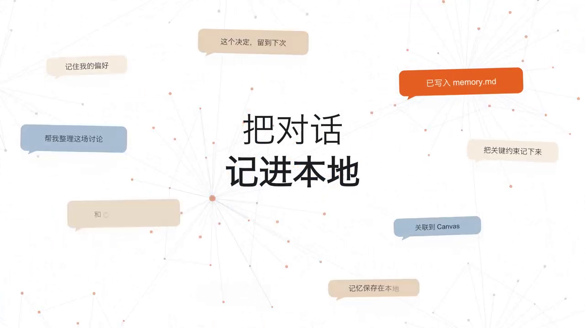

<p align="right">
  <a href="README_ZH.md"><b>简体中文</b></a> | <b>English</b>
</p>

<p align="center">
  
</p>

<p align="center">
  <a href="https://github.com/wuyifan-code/Claudian-plus/releases"></a>
  <a href="LICENSE"></a>
  <a href="https://obsidian.md/"></a>
  <a href="https://github.com/wuyifan-code/Claudian-plus/actions"></a>
  
</p>

<p align="center">
  <strong>Your notes remember. Now your AI does too.</strong><br>
  A local-first AI workspace for Obsidian that anchors multi-agent reasoning, cognitive memory (Dreaming V3), and provider sessions directly inside your personal Vault.
</p>

---

## 🎬 30-Second Product Demonstration

Watch how Claudian Plus weaves conversation logs into durable Vault knowledge, connects with your knowledge graph, and dispatches tasks across multiple agents:

<div align="center">
  <video src="docs/assets/claudian-plus-demo.mp4" controls="controls" muted="muted" width="100%" style="border-radius: 12px; box-shadow: 0 12px 40px rgba(0,0,0,0.18);" poster="docs/assets/claudian-plus-demo-cover.png">
    <a href="docs/assets/claudian-plus-demo.mp4">
      
    </a>
  </video>
  <p><em>▶ <a href="docs/assets/claudian-plus-demo.mp4">Click to view or download full HD demo video (30s)</a></em></p>
</div>

### Key Takeaways from the Video
- **Knowledge Graph Integration**: Every note, decision, and chat links into your Vault's link structure.
- **Dreaming V3**: After 30 seconds of typing silence, background micro-dreams distill conversations into `memory.md`.
- **Multi-Agent Bus**: Seamlessly switch between Codex CLI, Claude Code, Kimi ACP, and OpenCode/Pi without context fragmentation.

---

## 💡 Why Claudian Plus?

Most AI extensions treat chat history as ephemeral disposable text. Claudian Plus treats conversations as creative working sessions: context enters, decisions distill into memory, and every insight remains searchable a month later.

| Everyday Need | Traditional AI Extensions | Claudian Plus |
| :--- | :--- | :--- |
| **Long-term Continuity** | Lost once the conversation or tab closes | **Dreaming V3**: idle micro-dreams auto-distill facts into `memory.md` |
| **Agent Autonomy** | Locked into one provider's web chat assumptions | **Codex-first default** with Claude, Kimi ACP, and OpenCode/Pi parity |
| **Vault Grounding** | Manual copy-pasting into text boxes | Direct `@note`, `@folder`, drag-and-drop, Canvas & Properties queries |
| **Privacy & Security** | Chats indexed on external cloud servers | **0 KB telemetry**: All memories and sessions remain 100% inside your Vault |
| **Long Context Focus** | Wall-of-text reasoning clutter | **Floating Outline**: Collapses tool & thought noise; keeps headings clickable |

---

## 🌟 Core Capabilities

### 1. 🧠 Dreaming V3: Cognitive Memory Engine

Conversations end; memory continues. When your keyboard rests for 30 seconds, Claudian Plus triggers an unobtrusive background micro-dream:

<p align="center">
  
</p>

- **Idle Micro-Distillation**: Extracts preferences, decisions, and constraints into `.claudian-plus/memory.md`.
- **Budget-Bounded Injection**: Distilled insights are compacted within a strict **3,000 character budget** before being injected into subsequent sessions.
- **Cross-Source Deduplication**: Automatically resolves overlapping conclusions between multiple conversations.
- **Zero Distraction Overhead**: Runs at `<1.2%` idle CPU usage with full local control via **Open memory file**.

---

### 2. ⚡ Codex-First, Multi-Agent Bus

Work with the exact reasoning engine suited to your task. You are never restricted to a single vendor.

<p align="center">
  
</p>

- **Codex CLI (Default)**: Preferred default agent; automatically detects and leverages `gpt-5.6-sol` when exposed by your local CLI, with native real-time streaming output.
- **Claude Code**: Native support for Anthropic thinking chain folding, permission modes, and project-level session replay.
- **Kimi ACP Protocol**: Full ACP standard integration with dynamic model/command auto-discovery, tool approval dialogs, and multimodal image attachments.
- **OpenCode & Pi Sidecars**: Sandboxed sidecars utilizing Node built-ins and pre-bundled TypeBox, ensuring chat operates even when external tool dependencies are absent.

---

### 3. 🗺️ Your Vault is the True Workspace

Drop living context into the agent composer without breaking your writing flow:

- **Rich Context Ingestion**: Mention notes via `@note`, whole directories with `@folder`, drag-and-drop files, or highlight editor selections.
- **Visual Canvas & Graph Awareness**: Right-click any Canvas node to **Suggest neighboring notes** based on Obsidian's resolved link graph.
- **Safe Vault Guards**: File modifications display a clean, structured diff with in-session **Undo** protection.
- **Direct Metadata Extraction**: Fast `FROM` frontmatter queries execute without dependency on third-party plugin APIs.

---

## 🏛️ System Architecture

<p align="center">
  
</p>

---

## 🚀 Quickstart

### Method 1: Install from Release (Recommended)

1. Download `main.js`, `manifest.json`, and `styles.css` from the [Latest Release](https://github.com/wuyifan-code/Claudian-plus/releases/latest).
2. Inside your Obsidian Vault, navigate to `.obsidian/plugins/` and create a `claudian-plus/` directory.
3. Copy the three files into that folder.
4. In Obsidian, go to **Settings → Community plugins**, refresh, and toggle on **Claudian Plus**.

> *Note: Claudian Plus is desktop-only because it connects directly to local agent CLIs and the desktop filesystem.*

### Method 2: Build from Source

Requirements: **Node.js 24+** and at least one local provider CLI ([Codex](https://github.com/openai/codex), [Claude Code](https://claude.ai/claude-code), [OpenCode](https://opencode.ai/), [Kimi](https://github.com/MoonshotAI/kimi-cli), or [Pi](https://github.com/badlogic/pi-mono)).

```bash
# 1. Clone repository
git clone https://github.com/wuyifan-code/Claudian-plus.git
cd Claudian-plus

# 2. Install dependencies & verify types
npm ci
npm run typecheck

# 3. Build distribution package
npm run build
```

*Tip: Set `OBSIDIAN_VAULT=D:\\Obsidian\\My Vault` in `.env.local` to have `npm run build` auto-deploy files directly into your Vault!*

---

## ⌨️ Essential Commands

| Command | Action |
| :--- | :--- |
| `Open chat view` | Launches the primary Claudian Plus sidebar workspace |
| `Quick agent input` | Dispatches a focused prompt using active editor selection |
| `Search conversations` | Filters historical sessions by title, provider, model, or date |
| `Open memory file` | Inspects `.claudian-plus/memory.md` distilled by Dreaming V3 |
| `Scan vault knowledge` | Manually refreshes local Vault knowledge index |
| `Undo last Canvas write`| Safely reverts the last approved visual canvas modification |
| `Check provider CLI health`| Diagnoses missing, outdated, or misconfigured provider CLIs |

---

## 🔒 Privacy, Security & Data Layout

- **Zero Telemetry**: No tracking pings, no cloud analytics. All prompts, session archives, and memory files reside strictly in `.claudian-plus/` inside your Vault.
- **Provider Confidentiality**: Network calls occur exclusively through the CLI or API endpoint you configure.
- **Legacy Migration**: Claudian Plus automatically detects and non-destructively migrates historical data from legacy `.claudian/`.

---

## 🛠️ Engineering Verification

```bash
npm run typecheck            # Strict TypeScript boundary verification
npm run lint                 # ESLint checks
npm run test                 # Unit & integration test suites
npm run test:architecture    # Cross-layer architecture boundary enforcement
npm run check:performance    # Startup & memory hydration baselines
```

---

## 🤝 Upstream Projects & Attribution

Claudian Plus stands on the shoulders of two outstanding open-source projects:

| Upstream Project | Original Author | License | Contribution to Claudian Plus |
| :--- | :--- | :--- | :--- |
| **[Claudian](https://github.com/YishenTu/claudian)** | [Yishen Tu](https://github.com/YishenTu) | MIT | Core Obsidian agent workspace, provider abstraction, chat session foundation |
| **[Codian](https://github.com/BCS1037/codian)** | [BCS1037 / BCS](https://github.com/BCS1037) | AGPL-3.0 | Live Composer, File Explorer actions, shared Skills manager, provider settings |

*Original and Claudian-derived code are licensed under **MIT**; Codian-derived code retains **AGPL-3.0** obligations. See [LICENSE](LICENSE) and [NOTICE](NOTICE) for complete attribution details.*
