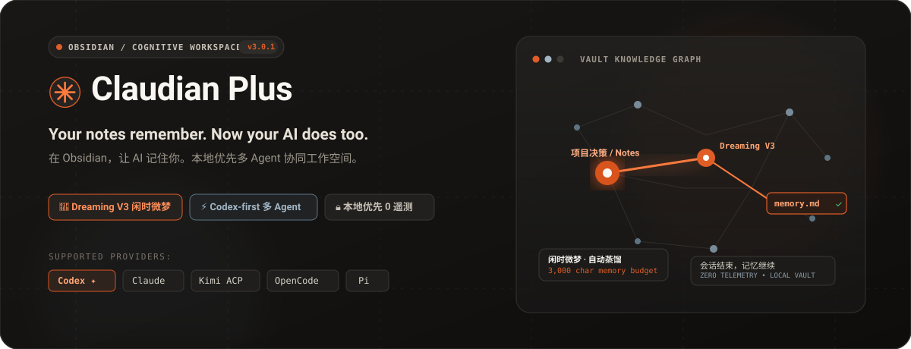
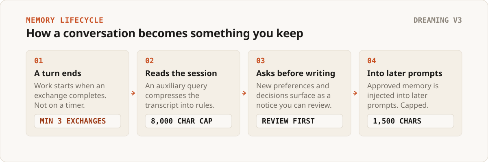
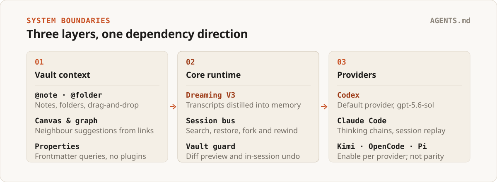

<p align="right">
  <a href="README_ZH.md">简体中文</a> | <b>English</b>
</p>

<p align="center">
  
</p>

<p align="center">
  <a href="https://github.com/wuyifan-code/Claudian-plus/releases"></a>
  <a href="LICENSE"></a>
  <a href="https://obsidian.md/"></a>
  <a href="https://github.com/wuyifan-code/Claudian-plus/actions"></a>
  
</p>

<p align="center">
  <strong>Your notes remember. Now your AI does too.</strong><br>
  Six coding agents in one Obsidian vault, with a memory file you own.
</p>

Claudian Plus embeds provider-backed coding agents directly into your Obsidian sidebar. Codex is the default; Claude, Kimi, OpenCode, Pi, and Antigravity plug into the same conversation model. When a session ends, its decisions do not evaporate — they are distilled into `.claudian-plus/memory.md`, a plain Markdown file inside your vault that you can read, edit, or delete.

---

## 🌟 What's New in V3.0.2

In **V3.0.2**, we introduced major architectural improvements, network resilience, and modern design enhancements:

### 1. Smart Tool Grouping & Auto-Collapse
- **Eliminate Chat Stream Clutter**: When an agent executes a sequence of multiple tool operations (e.g. 10+ consecutive file reads, bash commands, diff edits), tool items no longer overwhelm the screen vertically.
- **Dynamic Live Expansion with Auto-Collapse**: Tool calls expand smoothly during streaming execution so you can track live operations. Once the tool chain completes, the entire group automatically collapses into a compact ~28px summary bar.
- **Full Status Overview**: The summary bar displays the total call count (e.g., `13 calls`), distinct tool names, and an aggregated health indicator (green for full success, red if any tool fails). One click re-expands the list to inspect parameter details and code diffs.
- **Zero Overhead for Single Calls**: Single tool invocations remain displayed as clean, single-line items without unnecessary collapse nesting.

### 2. Antigravity (Gemini) System Proxy Tunneling & Network Resilience
- **Root-Cause Fix for Idle Disconnects (`WSAECONNRESET 10054`)**: Go CLIs (`agy.exe`) do not natively inspect the Windows Registry for Internet proxy settings. Under VPN / Clash TUN Fake-IP routing, idle TCP connections during extended multi-minute thinking turns were routinely severed by TUN idle timeouts after 4m 30s.
- **Zero-Config Automatic Registry Proxy Detection**: Claudian Plus now features an integrated Windows Registry system proxy sniffer (`resolveSystemProxyEnvironment`) that silently injects `HTTP_PROXY` into the child process. The CLI automatically routes via loopback tunnels to your local proxy, providing bulletproof connection stability without manual user configuration.
- **Official Brand Assets & Full Gemini Spectrum**: Shipped with official Antigravity SVG icons and comprehensive support for Gemini 3.1 Pro, 3.7 Flash, 3.8, and Thinking budget tuning.

### 3. Modern Minimalist Stop Button
- **Flagship AI Interface Parity**: Replaced the bulky, reddish rectangular Stop badge with a sleek, borderless circular stop button (`28px × 28px`) matching ChatGPT / DeepSeek design standards.
- **Adaptive High-Contrast Dual Theme**: High-contrast white circle with a dark rounded square in dark mode; solid dark circle with a white rounded square in light mode. Features tactile micro-motion (`scale(1.06)` hover, `scale(0.94)` active press) with native `Stop generation (Esc)` tooltip.

### 4. Layout & UI Polish
- **Header Icon Alignment**: Corrected the vertical drift on the provider icon in the header, preventing visual clipping at the top edge of the window.
- **About & Community Hub**: Integrated developer WeChat channel and issue feedback directly into the settings view.

---

## 01 / Watch it work

A 30-second animated overview of how the pieces fit together:

<div align="center">
  <a href="docs/assets/claudian-plus-demo.mp4">
    
  </a>
  <p><em>Click for the full-quality 30s 720p version.</em></p>
</div>

### Three things worth noticing

- **Context arrives as references, not pasted text.** `@note`, `@folder`, and drag-and-drop resolve against the vault you already have open.
- **Memory lands in a file you can open.** No database, no sync service — just `memory.md` sitting in your file list next to your notes.
- **The provider switches without the conversation breaking.** Each provider keeps its own session history, so a session can move between Codex, Claude, Kimi, OpenCode, and Antigravity.

---

## 02 / Why it is different

Most AI plugins treat conversation history as disposable text. Claudian Plus treats a session as a working record: context enters, decisions distill into memory, and the result stays searchable weeks later.

| What you need | Typical AI extension | Claudian Plus |
| :--- | :--- | :--- |
| **Continuity across sessions** | Erased when the window closes | Memory distilled into `memory.md`, injected into later prompts |
| **Provider choice** | Locked to one vendor's web assumptions | Codex by default, plus Claude, Kimi, OpenCode, Pi, and Antigravity |
| **Vault context** | Manual copy-paste into a chat box | `@note`, `@folder`, drag-and-drop, Canvas, frontmatter queries |
| **Data sovereignty** | Sessions indexed on someone else's server | Every prompt, session, and memory stays under `.claudian-plus/` |
| **Long-session focus** | A wall of tool calls and reasoning noise | Smart Tool Grouping & auto-collapse keeps the stream clean and readable |

---

## 03 / What this is not

- **Not a cloud service.** No telemetry or analytics code ships in this plugin. Network calls are made by the provider CLI you configure, from your machine.
- **Not a chat window bolted onto a note app.** Your memory is a Markdown file in your vault, not a row in someone's database.
- **Not a promise that every provider behaves the same.** Capabilities differ per provider and are declared explicitly, because the codebase is written so no feature can silently assume parity.

---

## 04 / How memory actually works

Conversations end; memory continues. The pipeline is deliberately boring — four steps, no timers, and nothing written behind your back.

<p align="center">
  
</p>

- **It is gated on real usage, not on a stopwatch.** Distillation is evaluated when a turn completes, and only once a session has at least **3 exchanges**. A separate hourly check consolidates older logs when a full interval has passed, and startup consolidates anything accumulated while Obsidian was closed.
- **Input is capped before the model sees it.** The transcript handed to the auxiliary query is truncated at **8,000 characters**, so distillation cost stays bounded on long sessions.
- **Nothing is written silently.** Newly extracted preferences and decisions surface as a notice and wait in Settings for you to accept.
- **Output is capped before it reaches your prompt.** Approved memory is injected within a **1,500 character** budget by default, split across a 350-character profile layer and a 500-character project layer. All three are adjustable in **Settings → Memory & Consciousness**.
- **You can always pull the plug.** `Open memory file` shows you exactly what has been distilled, and the file is plain Markdown.

> **Memory is opt-in.** `memoryEnabled` defaults to on, but the consciousness and auto-memory switches — the ones that send a transcript to an auxiliary query — default to **off** on new installations, because distilled memory contains personal context. Turn them on in **Settings → Memory & Consciousness** when you want it.

---

## 05 / Providers and the dependency rule

Three layers, one direction of dependency: vault context feeds a provider-neutral core, which dispatches to provider adaptors. Feature code depends on core contracts, never on provider internals.

<p align="center">
  
</p>

- **Codex CLI — enabled by default.** Default model `gpt-5.6-sol`, with native streaming output over `codex app-server`.
- **Claude Code — enabled by default.** Thinking-chain folding, permission modes, and native project history replay.
- **Antigravity (Gemini) — opt in.** Deep integration with automatic system proxy tunneling, multi-model selection, and official brand assets.
- **Kimi — opt in.** ACP integration with dynamic model and command discovery, per-tool approval dialogs, and multimodal image attachments.
- **OpenCode — opt in.** ACP agent over a sandboxed sidecar process.
- **Pi — opt in.** RPC-mode sidecar that runs on Node built-ins and a bundled TypeBox, so it still works when external tool dependencies are missing.

---

## 06 / Installation

### Method 1: Install from Release (Recommended)

1. Download `main.js`, `manifest.json`, and `styles.css` from the [Latest Release (v3.0.2)](https://github.com/wuyifan-code/Claudian-plus/releases/latest).
2. Create a folder named `.obsidian/plugins/claudian-plus/` inside your vault.
3. Copy the three downloaded files into that folder.
4. In Obsidian, go to **Settings → Community plugins**, refresh the installed list, and toggle **Claudian Plus** on.

> **Requirements:** Obsidian **1.11.4 or later**, desktop only. Claudian Plus communicates with local agent CLI processes and requires desktop filesystem access.

### Method 2: Build from source

Requires **Node.js 24**, plus at least one provider CLI installed locally: [Codex](https://github.com/openai/codex), [Claude Code](https://claude.ai/claude-code), [Antigravity](https://github.com/google/antigravity), [Kimi](https://github.com/MoonshotAI/kimi-cli), [OpenCode](https://opencode.ai/), or [Pi](https://github.com/badlogic/pi-mono).

```bash
git clone https://github.com/wuyifan-code/Claudian-plus.git
cd Claudian-plus

npm ci
npm run typecheck
npm run build
```

*Tip: Set `OBSIDIAN_VAULT=D:\Obsidian\My Vault` in `.env.local` so `npm run build` copies the build output directly to your vault.*

---

## 07 / Commands reference

| Command | Purpose |
| :--- | :--- |
| `Open chat view` | Open the Claudian Plus sidebar workspace |
| `Quick agent input` | Send a targeted instruction using current editor selection |
| `New tab` | Open a new session tab |
| `New session (in current tab)` | Start a new conversation in the active tab |
| `Close current tab` | Close the active session tab |
| `Inline edit with AI` | Edit selected text in place |
| `Summarize current note` | Produce a structured summary of the active note |
| `Suggest tags for current note` | Suggest relevant tags based on note content |
| `Create MOC for topic` | Generate a Map of Content note for a topic |
| `Open memory file` | Open the Markdown file distilled by Dreaming V3 |
| `Cleanup expired short-term memories` | Remove expired short-term memory entries |
| `Dream: consolidate short-term memories` | Manually trigger a memory consolidation pass |
| `Scan vault knowledge` | Rebuild the local knowledge index |
| `Undo last canvas write` | Revert the most recent approved Canvas modification |
| `Check provider CLI health` | Inspect provider CLIs for missing binaries, outdated versions, or configuration errors |
| `Copy startup diagnostics` | Copy startup diagnostics for filing issues |

---

## 08 / Privacy & Storage Layout

Everything the plugin knows lives inside your vault:

```text
<your-vault>/
├── .claudian-plus/
│   ├── claudian-plus-settings.json    # Shared settings + provider configs
│   ├── memory.md                      # Distilled memory injected into prompts
│   └── sessions/
│       └── *.meta.json                # Session metadata
├── .claudian/                         # Legacy Claudian data, read-only migration
└── .obsidian/plugins/claudian-plus/
    ├── main.js
    ├── manifest.json
    └── styles.css
```

- **No telemetry.** There is zero analytics code under `src/`. Data leaves your machine only via the provider CLIs you configure.
- **Data safety during migration.** Existing `.claudian/` directories are detected and migrated non-destructively; original files remain intact.
- **Settings merge cleanly.** Provider settings are merged rather than clobbered, preserving existing configs across updates.

---

## 09 / Development & Testing

```bash
npm run dev                  # Build CSS + start esbuild in watch mode
npm run typecheck            # TypeScript type check
npm run lint                 # ESLint checks
npm run test                 # Run all unit and integration tests
npm run test:watch           # Run tests in watch mode
npm run test:coverage        # Generate test coverage report
npm run test:architecture    # Architecture boundary enforcement
npm run check:performance    # Bundle size and startup performance check
```

---

## 10 / Upstream Projects

Claudian Plus is built upon two upstream open-source projects:

| Project | Author | License | Contribution |
| :--- | :--- | :--- | :--- |
| **[Claudian](https://github.com/YishenTu/claudian)** | [Yishen Tu](https://github.com/YishenTu) | MIT | Obsidian Agent workspace, provider abstraction, foundational session architecture |
| **[Codian](https://github.com/BCS1037/codian)** | [BCS1037 / BCS](https://github.com/BCS1037) | AGPL-3.0 | Live Composer, file browser actions, unified skills management, provider settings |

*Original and Claudian-derived code is licensed under **MIT**; Codian-derived code retains **AGPL-3.0** obligations. See [LICENSE](LICENSE) and [NOTICE](NOTICE).*

---

## 💡 Community & Follow

> **致力于探索解决问题的极简方式 (Committed to exploring minimalist ways to solve problems)**

If you encounter any issues, have questions, or want to explore feature ideas:

- File an Issue: [GitHub Issues](https://github.com/wuyifan-code/Claudian-plus/issues)
- WeChat Official Account: **「递归识海」**
- Follow & Updates: [关注公众号：递归识海](https://mp.weixin.qq.com/s/m2AVQl2PdXERGmIrx4jiuA)
