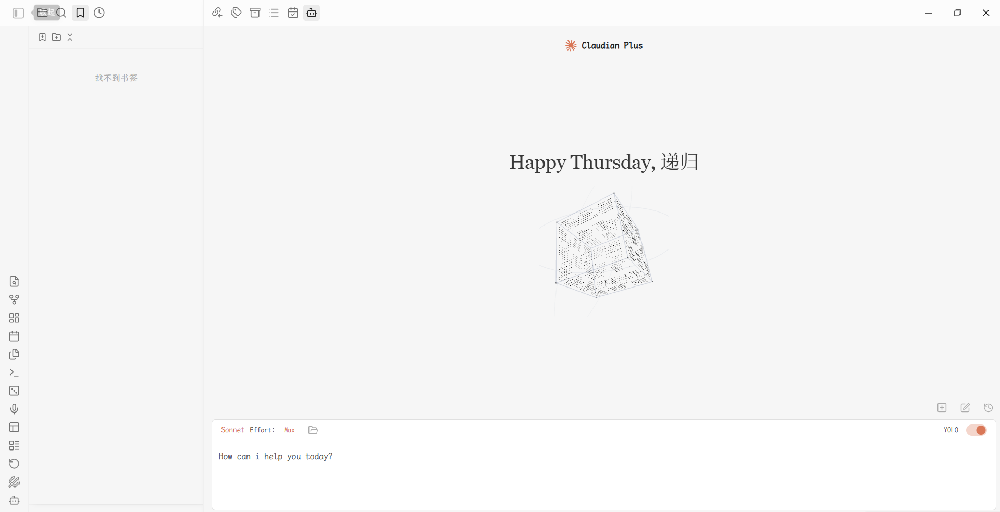

# Claudian Plus

<p align="center">
  
</p>

<p align="center">
  <strong>A Codex-first AI workspace for people who think in notes.</strong><br>
  Chat with local agents, bring your Vault into context, and turn conversations into durable knowledge.
</p>

<p align="center">
  <a href="https://github.com/wuyifan-code/Claudian-plus/releases"></a>
  <a href="LICENSE"></a>
  <a href="https://obsidian.md/"></a>
  <a href="https://github.com/wuyifan-code/Claudian-plus/actions"></a>
</p>

<p align="center"><a href="README_ZH.md">简体中文</a></p>

Claudian Plus keeps the power of coding agents close to your notes. It combines Codex, Claude, OpenCode, and Pi in one desktop-only Obsidian workspace while keeping conversations, memory, retrieval indexes, and provider sessions local to your Vault.

## Why Claudian Plus?

Most AI chat tools forget the context that matters. Claudian Plus starts from the opposite assumption: your notes are the workspace, the conversation is a working session, and useful conclusions should remain discoverable after the chat is closed.

| You want to… | Claudian Plus gives you… |
| --- | --- |
| Work with the agent you already use | Codex-first defaults, provider-native sessions, model discovery, and separate permission flows |
| Keep the Vault in the loop | `@note` / `@folder` context, drag-and-drop files, images, editor selection, File Explorer actions, Canvas, Properties, and links |
| Find something you discussed last month | Local conversation history search, restore, fork, rewind, and provider-native replay |
| Build a second brain without a cloud index | Opt-in memory, awareness files, incremental Vault retrieval, source previews, and optional local embeddings |
| Stay oriented in a long conversation | A compact floating outline that surfaces user prompts and assistant headings while collapsing thought/tool noise |

## Highlights

### Codex-first, provider-aware

Codex is the default agent when available, with a preference for `gpt-5.6-sol` when the local CLI exposes it. Claude, OpenCode, and Pi remain first-class alternatives, but each provider keeps its own capabilities, history format, permissions, and runtime boundary.

### Local memory and retrieval

- Opt-in automatic memory extraction and explicit remember/forget commands.
- Awareness files for long-term memory, user profile, short-term context, and activity.
- Incremental Vault retrieval with lexical, CJK n-gram, path, heading, link, recency, and character n-gram signals.
- `/vault-search` for source-backed search and `/insight` for a cited insight workflow.
- Optional semantic reranking through a local Ollama or OpenAI-compatible embeddings endpoint. It is disabled by default and falls back to local lexical search.

### Native Obsidian context

Bring context into the composer with `@note`, `@folder`, drag-and-drop, image attachments, and File Explorer actions. Provider-native tools can read and, with approval, update Canvas, Properties, links, and graph neighbors. Writes remain Vault-scoped, show a structured diff, and support session-level undo where available.

### A calmer chat surface

The floating outline is designed for navigation, not decoration: prompt markers and assistant headings stay visible, while thoughts and tool output remain collapsed in the chat body. Choose the bars or dots style from settings.

### One workspace for agent resources

Manage MCP servers, slash commands, Skills, subagents, provider enablement, and environment snippets from the same settings surface. UI language follows the selected Obsidian locale.

## Install from a release

1. Download `main.js`, `manifest.json`, and `styles.css` from the [latest release](https://github.com/wuyifan-code/Claudian-plus/releases/latest).
2. Create `<vault>/.obsidian/plugins/claudian-plus/`.
3. Copy the three files into that directory.
4. In Obsidian, open **Settings → Community plugins** and enable **Claudian Plus**.

Claudian Plus is desktop-only because it integrates with local agent CLIs and desktop filesystem capabilities.

## Build from source

Requirements: Node.js 24 and at least one supported provider CLI.

```bash
git clone https://github.com/wuyifan-code/Claudian-plus.git
cd Claudian-plus
npm ci
npm run typecheck
npm run build
```

To copy the production build directly into a Vault, set `OBSIDIAN_VAULT` in `.env.local`:

```text
OBSIDIAN_VAULT=D:\\Obsidian\\My Vault
```

Then run `npm run build` again. The build copies the three plugin files into `<vault>/.obsidian/plugins/claudian-plus/`.

## First run

1. Install and authenticate a provider CLI. Codex is the default provider when it is available.
2. Open **Claudian Plus → Settings**. If Obsidian does not inherit your shell `PATH`, set the provider's absolute CLI path.
3. Keep the permission mode at `normal` until you understand the provider-specific approval flow.
4. Enable memory, automatic Vault context, review, and link suggestions only when you want those features.
5. For semantic retrieval, run a local embedding service such as Ollama, enable **Local semantic search**, and configure the endpoint/model in settings.

## Useful commands and workflows

- **Open chat view** — open the main Claudian Plus workspace.
- **Quick agent input** — send a focused request with the current editor context.
- **Search conversations** — filter saved history by title, provider, model, date, or first message.
- **Open vault health** — inspect retrieval, provider, and Vault diagnostics.
- **Rebuild vault retrieval index** — rebuild the local source index after a large Vault change.
- **Open memory file** / **Scan vault knowledge** — inspect or refresh the local memory layer.
- **Undo last Canvas write** — undo an approved Canvas operation during the current Obsidian session.

Inside the composer, use `/vault-search <query>` for source search and `/insight <topic>` for a source-grounded insight task. You can drag a note or folder into the composer at any time.

## Privacy, permissions, and storage

Claudian Plus has no telemetry service. Provider requests are sent only through the provider, CLI, SDK, MCP server, or embedding endpoint that you explicitly configure. Vault retrieval and memory data are stored locally under `.claudian-plus/`.

The plugin reads legacy `.claudian/` data and migrates it to `.claudian-plus/` when the relevant data is next saved. Do not run an old Claudian build and Claudian Plus against the same Vault at the same time. Agent tools can read files, run commands, and modify approved Vault data; review the active provider and permission mode before working with sensitive notes.

## Verification

```bash
npm run typecheck
npm run lint
npm run test
npm run test:architecture
npm run build
npm run check:performance
```

## Upstream projects, licenses, and thanks

Claudian Plus is built on the work of two upstream projects. Their authors and license terms remain part of this distribution:

| Upstream project | Original author | License | Contribution to Claudian Plus |
| --- | --- | --- | --- |
| [Claudian](https://github.com/YishenTu/claudian) | [Yishen Tu](https://github.com/YishenTu) | [MIT](https://github.com/YishenTu/claudian/blob/main/LICENSE) | Core Obsidian agent workspace, provider architecture, chat/session foundation, and the original Claudian workflows |
| [Codian](https://github.com/BCS1037/codian) | [BCS1037 / BCS](https://github.com/BCS1037) | [AGPL-3.0](https://github.com/BCS1037/codian/blob/main/LICENSE) | Adapted live composer, File Explorer actions, shared Skills management, provider service settings, and related UX improvements |

Thank you to Yishen Tu, BCS, and both project communities for publishing the ideas and code that made this fork possible. See [NOTICE](NOTICE) for the file-level attribution summary.

This repository contains original work together with code under different upstream licenses. The MIT license applies to the Claudian-derived and original portions; Codian-derived portions retain the AGPL-3.0 obligations described by their upstream license. If you redistribute or modify those portions, follow the applicable upstream terms.

## License

See [LICENSE](LICENSE) and [NOTICE](NOTICE). The upstream license terms above are part of this distribution.
