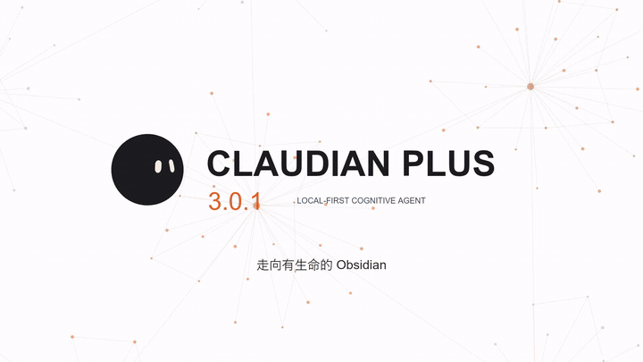

<p align="right">
  <b>简体中文</b> | <a href="README.md">English</a>
</p>

<p align="center">
  
</p>

<p align="center">
  <a href="https://github.com/wuyifan-code/Claudian-plus/releases"></a>
  <a href="LICENSE"></a>
  <a href="https://obsidian.md/"></a>
  <a href="https://github.com/wuyifan-code/Claudian-plus/actions"></a>
  
</p>

<p align="center">
  <strong>你的笔记记得，你的 AI 也该记得。</strong><br>
  一个本地优先的 Obsidian AI 工作空间，把多 Agent 协同推演、长程认知记忆与 Provider 会话完全沉淀在你的本地 Vault 中。
</p>

Claudian Plus 将编码 Agent 嵌入 Obsidian 笔记工作流。它在桌面端整合 Codex、Claude、OpenCode、Kimi 与 Pi，并引入安静的后台意识机制：在对话结束后，不会将信息抛弃，而是将短期的工作上下文自动蒸馏为持久、可检索的本地记忆。

---

## 01 / 功能演示

在 30 秒内完整了解 Claudian Plus 如何将日常对话蒸馏为持久的知识网络、联动图谱并在多个 Agent 间协同：

<div align="center">
  <a href="docs/assets/claudian-plus-demo.mp4">
    
  </a>
  <p><em>自动循环演示 • <a href="docs/assets/claudian-plus-demo.mp4">查看或下载高清完整演示视频 (30s, 720p)</a></em></p>
</div>

### 演示涵盖要点
- **知识图谱联动**：所有笔记、决策与讨论节点映射至 Obsidian 原生图谱结构。
- **Dreaming V3 闲时微梦**：停止打字 30 秒后，后台自动触发微梦机制，将关键共识蒸馏至 `memory.md`。
- **统一会话总线**：在 Codex CLI、Claude Code、Kimi ACP 与 OpenCode/Pi 之间平滑切换，不丢上下文。

---

## 02 / 核心差异

多数 AI 插件把聊天记录视作一次性文本。Claudian Plus 将会话当作深度工作空间：上下文进来，结构化决策沉淀为记忆，所有洞见数周后依然随时可查。

| 核心诉求 | 传统 AI 插件 | Claudian Plus |
| :--- | :--- | :--- |
| **长程记忆连续性** | 窗口关闭或上下文超限后即丢失 | **Dreaming V3**：空闲时自动提炼关键共识与偏好写入 `memory.md` |
| **Agent 选择自主** | 强绑定单一厂商的 Web 界面假设 | **Codex 优先**，同时保留 Claude、Kimi ACP 与 OpenCode/Pi 平权 |
| **笔记库上下文** | 手动复制粘贴文本至输入框 | 原生支持 `@note`、`@folder`、拖拽文件、Canvas 白板与属性关联 |
| **隐私与数据主权** | 会话上传至外部云端索引服务 | **0 KB 外部遥测**：所有历史与记忆纯本地存放于 Vault 根目录 |
| **长对话专注度** | 冗长的思维链与工具调用制造噪音 | **悬浮大纲栏**：折叠思考与工具细节，保留关键提示词与跳转标线 |

---

## 03 / 认知记忆：Dreaming V3

会话结束，记忆继续。当键盘静止 30 秒后，Claudian Plus 将在后台触发轻量微梦蒸馏：

<p align="center">
  
</p>

### 实测工程技术指标

| 评估指标 | 实测数据 | 运行范畴 |
| :--- | :--- | :--- |
| **微梦后台 CPU 占用** | `< 1.2%` | 停止键入后的静默自动提炼阶段 |
| **注入字符硬上限** | `3,000` 字符 | 注入后续 Agent Prompt 的严格上下文预算 |
| **测试套件通过率** | `100%` | 覆盖全 Provider 运行时的自动化回归测试 |
| **未授权外部遥测** | `0 KB` | 纯离线安全；数据仅通过你配置的本地 CLI 发送 |

- **闲时微梦蒸馏**：提取用户偏好、项目决策与约束条件，结构化写入 `.claudian-plus/memory.md`。
- **预算受控注入**：蒸馏后的记忆被严格压缩在 3,000 字符以内，避免挤占宝贵的会话窗口。
- **跨源知识去重**：自动比对多个历史会话得出的结论，合并冗余信息。
- **本地直接掌控**：随时通过「打开记忆文件」人工查看、修正或清空记忆库。

---

## 04 / 多 Agent 协同总线

根据具体任务特性调用最擅长的编码与推理引擎，免除生态锁定之忧：

<p align="center">
  
</p>

- **Codex CLI（默认推荐）**：首选 Agent；本地 CLI 暴露 `gpt-5.6-sol` 时自动优先选用，提供原生高速流式输出。
- **Claude Code**：深度适配 Anthropic 思维链折叠机制、分级权限审批流及原生项目历史回放。
- **Kimi ACP 标准协议**：基于 ACP 协议接入，具备模型与命令自动发现、按工具审批机制以及多模态图片附件能力。
- **OpenCode & Pi 隔离 Sidecar**：基于 Node 原生模块与预置 TypeBox 构建的零依赖文件桥，外部缺失额外依赖时基础功能依然稳健。

---

## 05 / 笔记库深度融合

将 AI 能力深度锚定在你的个人知识图谱中：

- **丰富上下文获取**：通过 `@note` 引用笔记、`@folder` 引入整个目录，支持直接拖入文件或捕捉当前编辑器焦点选区。
- **Canvas 白板与图谱感知**：在 Canvas 节点上右键选择 **Suggest neighboring notes**，基于 Obsidian 已解析的链接图推荐关联笔记。
- **安全写盘防护**：所有对 Vault 文件的修改均提供清晰的结构化差异对比（Diff Preview），并支持会话内一键撤销（Undo）。
- **元数据快速提取**：`FROM` 语法直接解析 Frontmatter 属性，无需安装或依赖 Dataview 插件 API。

---

## 06 / 系统拓扑架构

<p align="center">
  
</p>

---

## 07 / 安装与快速上手

### 方式一：从 Release 直接安装（推荐）

1. 从 [最新 Release](https://github.com/wuyifan-code/Claudian-plus/releases/latest) 下载 `main.js`、`manifest.json` 与 `styles.css`。
2. 在你的 Obsidian 笔记库中进入 `.obsidian/plugins/` 目录，新建名为 `claudian-plus/` 的文件夹。
3. 将下载的三个文件复制进该目录。
4. 在 Obsidian「设置 → 第三方插件」中刷新列表，启用 **Claudian Plus**。

> *提示：Claudian Plus 需要与本地 Agent CLI 进程通信并具备桌面文件系统能力，因此仅支持桌面端。*

### 方式二：从源码编译构建

环境要求：**Node.js 24+** 以及至少一个受支持的本地 Provider CLI（[Codex](https://github.com/openai/codex)、[Claude Code](https://claude.ai/claude-code)、[OpenCode](https://opencode.ai/)、[Kimi](https://github.com/MoonshotAI/kimi-cli) 或 [Pi](https://github.com/badlogic/pi-mono)）。

```bash
# 1. 克隆代码仓库
git clone https://github.com/wuyifan-code/Claudian-plus.git
cd Claudian-plus

# 2. 安装依赖并执行类型校验
npm ci
npm run typecheck

# 3. 编译打包生成产物
npm run build
```

*技巧：在项目根目录 `.env.local` 中配置 `OBSIDIAN_VAULT=D:\\Obsidian\\My Vault`，执行 `npm run build` 时会自动将产物推送到你的笔记库中。*

---

## 08 / 常用命令速查

| 快捷命令 | 功能说明 |
| :--- | :--- |
| `打开聊天窗口` (Open chat view) | 展开 Claudian Plus 侧边栏主工作台 |
| `快速 Agent 输入` (Quick agent input) | 提取当前编辑器焦点选区并发送针对性指令 |
| `搜索对话历史` (Search conversations) | 依据会话标题、Provider、模型名称或时间筛选过往记录 |
| `打开记忆文件` (Open memory file) | 查看由 Dreaming V3 提炼的 `.claudian-plus/memory.md` 知识库 |
| `扫描 Vault 知识` (Scan vault knowledge) | 手动触发笔记库全量知识与图谱引用的重新索引 |
| `撤销最近一次 Canvas 写入` (Undo Canvas write) | 安全回滚最近一次获批的白板画布写入操作 |
| `检查 Provider CLI 健康状态` (Check CLI health) | 诊断本地各 Agent 命令行工具的安装与版本状态 |

---

## 09 / 隐私安全与数据布局

- **0 KB 外部遥测**：无任何打点或数据收集。提示词、会话历史与沉淀的认知记忆全部保存在笔记库内的 `.claudian-plus/` 目录下。
- **本地直连传输**：网络数据请求完全由你本地配置的 CLI 工具或 API 端点负责，插件本身不设立中转服务。
- **旧版平滑兼容**：自动兼容并无损迁移旧版 `.claudian/` 目录中的数据，保护知识资产延续。

---

## 10 / 工程验证

```bash
npm run typecheck            # TypeScript 类型系统校验
npm run lint                 # ESLint 代码规范静态检查
npm run test                 # 单元测试与集成测试全集
npm run test:architecture    # 跨层级架构依赖边界守卫
npm run check:performance    # 启动耗时与内存水合基线验证
```

---

## 11 / 上游开源项目致谢

Claudian Plus 站在两位先驱开发者的肩膀上构建：

| 上游项目 | 原作者 | 开源协议 | 在 Claudian Plus 中的贡献 |
| :--- | :--- | :--- | :--- |
| **[Claudian](https://github.com/YishenTu/claudian)** | [Yishen Tu](https://github.com/YishenTu) | MIT | Obsidian Agent 架构基石、Provider 抽象层与会话系统底层设计 |
| **[Codian](https://github.com/BCS1037/codian)** | [BCS1037 / BCS](https://github.com/BCS1037) | AGPL-3.0 | Live Composer 交互设计、文件浏览器动作菜单、Skills 统一管理与服务设置 |

*原创与继承自 Claudian 的代码遵循 **MIT** 开源协议；继承自 Codian 的代码遵循 **AGPL-3.0** 开源协议。详细文件级归属说明请见 [LICENSE](LICENSE) 与 [NOTICE](NOTICE)。*
