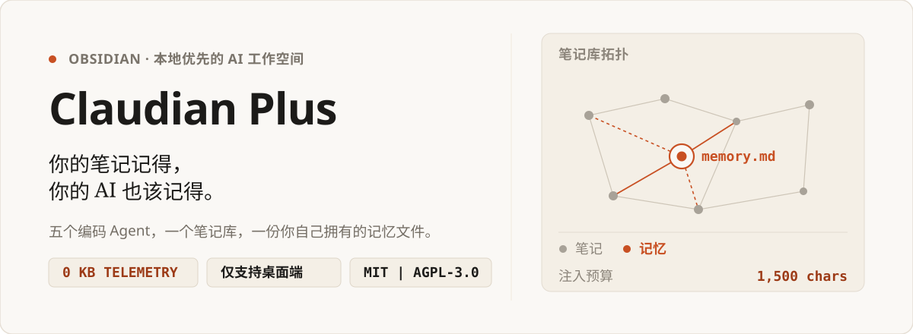

<p align="right">
  <b>简体中文</b> | <a href="README.md">English</a>
</p>

<p align="center">
  
</p>

<p align="center">
  <a href="https://github.com/wuyifan-code/Claudian-plus/releases"></a>
  <a href="LICENSE"></a>
  <a href="https://obsidian.md/"></a>
  <a href="https://github.com/wuyifan-code/Claudian-plus/actions"></a>
  
</p>

<p align="center">
  <strong>你的笔记记得，你的 AI 也该记得。</strong><br>
  六个编码 Agent，一个笔记库，一份属于你自己的记忆文件。
</p>

Claudian Plus 把编码 Agent 深度整合进 Obsidian 侧边栏。默认使用 Codex，Claude、Kimi、OpenCode、Pi 与 Antigravity 接入同一套会话模型。一次对话结束后，它的结论不会蒸发——而是被蒸馏进笔记库里的 `.claudian-plus/memory.md`，一份你可以随时打开、修改、删除的纯 Markdown 文件。

---

## 🌟 V3.0.2 重大更新与核心体验优化

在 **V3.0.2** 中，我们针对长任务交互痛点、网络通信稳定性与视觉体验带来了跨越式升级：

### 1. 连续工具调用智能聚合与自动折叠（Tool Grouping & Auto-Collapse）
- **告别刷屏噪音**：当 Agent 在一次回答中连续调用多个工具（如 10+ 步阅读文件、执行命令、编辑代码）时，不再自上而下铺满整个聊天流。
- **流式展开，完结自折**：工具执行期间动态展开，实时查看当前运行步骤；一旦本轮工具执行完成，整组自动收起为高度仅 ~28px 的单行紧凑卡片。
- **全局状态与一览无余**：卡片上实时显示执行总次数（如 `13 calls`）、调用工具名称摘要，以及全组状态指示灯（任一失败亮红报错，全部成功亮绿）；点击即可随时展开复查详情与代码 Diff。
- **单个工具零干扰**：若仅调用单步工具，保持轻量单行呈现，绝不增加多余的点击折叠负担。

### 2. Antigravity (Gemini) 网络连接稳定性根治与系统代理穿透
- **彻底解决 TUN 虚拟网卡闲置超时断流**：针对 Windows 环境下 Go 编写的 `agy.exe` 不主动读取注册表代理导致走直连、被 Clash/Mihomo TUN Fake-IP 截获并在 4 分钟长思考后被误杀断流（`WSAECONNRESET 10054`）的深层底层机制问题，插件加入了**Windows 注册表系统代理自动嗅探引擎**。
- **零配置，即开即用**：自动探测本机活动系统代理并为子进程静默挂载 `HTTP_PROXY`，彻底打通回环稳定长连接，免去用户手动配置环境变量的烦恼。
- **品牌视觉归位**：集成原生 Antigravity 官方高保真 SVG 图标，告别错用图标；支持 Gemini 3.1 Pro、3.7 Flash、3.8 等最新模型及 Thinking 预算控制。

### 3. 全新旗舰级极简圆形打断按钮（Modern Minimalist Stop Button）
- **对标顶级现代 AI 交互**：彻底移除了突兀的红色边框矩形、"Stop" 文本与键盘徽章，采用极简正圆矢量设计（`28px × 28px`），内嵌圆角停止方块。
- **高反差双主题自适应**：深色模式下为纯白圆底内嵌纯黑圆角方块，浅色模式下为纯黑圆底内嵌纯白圆角方块；配备细腻的触控放大（`scale(1.06)`）与实体按压（`scale(0.94)`）物理动效，悬停原生展示 `停止生成 (Esc)` 提示。

### 4. 界面与排版全面精致化
- **图标上浮修复**：修复了顶部 Provider 图标因定位漂移导致被窗口顶部截断的问题，无论窗口如何缩放始终居中优雅呈现。
- **关于面板焕新**：新增关于卡片与作者公众号互动专区。

---

## 01 / 看看它怎么跑

一段 30 秒的动画概览，说清各部分如何拼在一起：

<div align="center">
  <a href="docs/assets/claudian-plus-demo.mp4">
    
  </a>
  <p><em>点击查看完整画质的 30 秒 720p 版本。</em></p>
</div>

### 三个值得留意的地方

- **上下文以引用形式进来，不是粘贴进来的文本。** `@note`、`@folder` 与拖拽文件都解析自你已经打开的那个笔记库。
- **记忆落在你可以打开的文件里。** 没有数据库，没有同步服务——`memory.md` 就躺在你的文件列表中，和笔记排在一起。
- **切换 Provider 不会打断会话。** 每个 Provider 各自保留自己的历史，同一段会话可以在 Codex、Claude、Kimi、OpenCode 与 Antigravity 之间无缝流转。

---

## 02 / 核心差异

多数 AI 插件把聊天记录当成一次性文本。Claudian Plus 把一次会话当作工作记录：上下文进来，结论沉淀为记忆，几周之后依然可查。

| 你的需求 | 常见的 AI 插件 | Claudian Plus |
| :--- | :--- | :--- |
| **跨会话的连续性** | 关掉窗口就没了 | 蒸馏进 `memory.md`，注入到后续 Prompt |
| **选择 Provider 的自由** | 被绑死在单一厂商的网页假设上 | 默认 Codex，另有 Claude、Kimi、OpenCode、Pi、Antigravity |
| **笔记库上下文** | 手动复制粘贴进输入框 | `@note`、`@folder`、拖拽、Canvas、Frontmatter 查询 |
| **数据主权** | 会话被索引到别人的服务器上 | 所有 Prompt、会话与记忆都留在 `.claudian-plus/` 下 |
| **长对话专注度** | 满屏的工具调用与思考噪音 | 智能聚合自动折叠 + 悬浮大纲，把噪音收纳于无形 |

---

## 03 / 它不是什么

- **不是云服务。** 本插件不含任何遥测或统计代码。网络请求由你自己配置的 Provider CLI 从本机发出。
- **不是给笔记软件外挂的聊天窗。** 你的记忆是笔记库里的一个 Markdown 文件，不是别人数据库里的一行记录。
- **不承诺所有 Provider 表现一致。** 各家能力本就不同，且被显式声明——代码层面刻意设计成任何功能都无法悄悄假设对等。

---

## 04 / 记忆到底是怎么运作的

会话会结束，记忆继续。这条链路刻意做得很朴素——四步，没有计时器，也不会背着你写任何东西。

<p align="center">
  
</p>

- **触发条件是真实使用，不是秒表。** 蒸馏在一轮对话结束时评估，且要求当前会话至少有 **3 轮**交流。另有每小时一次的到期检查来合并更早的日志，启动时也会合并 Obsidian 关闭期间累积的内容。
- **进入模型之前先截断。** 交给辅助查询的记录被截断在 **8,000 字符**以内，所以长会话的蒸馏开销是有界的。
- **不会静默写入。** 新提取出的偏好与决策会以通知形式浮现，在设置里等你去确认。
- **进入 Prompt 之前先限流。** 获批的记忆默认在 **1,500 字符**预算内注入，其中画像层 350 字符、项目层 500 字符。三个数值都可以在 **设置 → 记忆与意识** 中调整。
- **你随时可以拔掉电源。** `打开记忆文件` 会如实展示被蒸馏了什么，而那个文件就是纯 Markdown。

> **记忆是选择性开启的。** `memoryEnabled` 默认为开，但真正会把会话内容发给辅助查询的意识与自动记忆开关，在新装环境下默认**关闭**——因为蒸馏出的记忆包含个人上下文。想用时，在 **设置 → 记忆与意识** 里打开。

---

## 05 / Provider 与依赖方向

三层结构，依赖只有一个方向：笔记库上下文喂给 Provider 中立的内核，内核再分派给各 Provider 适配器。功能代码只依赖内核契约，从不依赖 Provider 内部实现。

<p align="center">
  
</p>

- **Codex CLI —— 默认启用。** 默认模型 `gpt-5.6-sol`，通过 `codex app-server` 原生流式输出。
- **Claude Code —— 默认启用。** 支持思维链折叠、权限模式与原生项目历史回放。
- **Antigravity (Gemini) —— 需手动开启。** 深度封装 `agy` CLI，支持全自动系统代理探测与注入、多模型切换与原生品牌图标。
- **Kimi —— 需手动开启。** 基于 ACP 协议接入，具备模型与命令自动发现、按工具审批以及多模态图片附件。
- **OpenCode —— 需手动开启。** 运行在隔离 sidecar 进程上的 ACP Agent。
- **Pi —— 需手动开启。** RPC 模式的 sidecar，外部工具依赖缺失时依然可用。

---

## 06 / 安装

### 方式一：从 Release 安装（推荐）

1. 从 [最新 Release (v3.0.2)](https://github.com/wuyifan-code/Claudian-plus/releases/latest) 下载 `main.js`、`manifest.json` 与 `styles.css`。
2. 在你的笔记库中新建 `.obsidian/plugins/claudian-plus/` 目录。
3. 把这三个文件复制进去。
4. 在 Obsidian 中打开 **设置 → 第三方插件**，刷新列表并启用 **Claudian Plus**。

> **环境要求：** Obsidian **1.11.4 或更高版本**，且仅支持桌面端。Claudian Plus 需要与本地 Agent CLI 进程通信并访问桌面文件系统，因此没有移动端构建。

### 方式二：从源码构建

需要 **Node.js 24**，以及至少一个 Provider CLI：[Codex](https://github.com/openai/codex)、[Claude Code](https://claude.ai/claude-code)、[Antigravity](https://github.com/google/antigravity)、[Kimi](https://github.com/MoonshotAI/kimi-cli)、[OpenCode](https://opencode.ai/) 或 [Pi](https://github.com/badlogic/pi-mono)。

```bash
git clone https://github.com/wuyifan-code/Claudian-plus.git
cd Claudian-plus

npm ci
npm run typecheck
npm run build
```

*技巧：在 `.env.local` 中设置 `OBSIDIAN_VAULT=D:\Obsidian\My Vault`，`npm run build` 就会把构建产物直接送进你的笔记库。*

---

## 07 / 命令速查

| 命令 | 作用 |
| :--- | :--- |
| `Open chat view` | 打开 Claudian Plus 侧边栏工作台 |
| `Quick agent input` | 取当前编辑器选区，发送一条针对性指令 |
| `New tab` | 新开一个会话标签页 |
| `New session (in current tab)` | 在当前标签页里开一段新会话 |
| `Close current tab` | 关闭当前会话标签页 |
| `Inline edit with AI` | 就地编辑选中的文本 |
| `Summarize current note` | 总结你正在编辑的笔记 |
| `Suggest tags for current note` | 依据笔记内容推荐标签 |
| `Create MOC for topic` | 为某个主题生成内容地图（MOC）笔记 |
| `Open memory file` | 打开由 Dreaming V3 蒸馏出的记忆文件 |
| `Cleanup expired short-term memories` | 清理已过期的短期记忆条目 |
| `Dream: consolidate short-term memories` | 手动执行一次记忆巩固 |
| `Scan vault knowledge` | 重建本地笔记库知识索引 |
| `Undo last canvas write` | 回滚本次会话中最近一次获批的 Canvas 写入 |
| `Check provider CLI health` | 检查各 Provider CLI 是否缺失、过期或配置有误 |
| `Copy startup diagnostics` | 复制启动诊断信息，便于提 Issue |

---

## 08 / 隐私与数据布局

插件知道的一切都在你的笔记库内：

```text
<你的笔记库>/
├── .claudian-plus/
│   ├── claudian-plus-settings.json    # 共享设置 + 各 Provider 配置
│   ├── memory.md                      # 蒸馏后用于注入的记忆
│   └── sessions/
│       └── *.meta.json                # 各会话的元数据
├── .claudian/                         # 旧版数据，只读兼容
└── .obsidian/plugins/claudian-plus/
    ├── main.js
    ├── manifest.json
    └── styles.css
```

- **无遥测。** `src/` 下没有任何统计或埋点代码。离开本机的数据只经由你配置的 Provider CLI 或 API 端点。
- **迁移不会毁数据。** 旧版 `.claudian/` 目录会被检测并无损迁移，原始文件保留。
- **设置写入采用合并。** Provider 自有配置是合并而非覆盖，升级不会抹掉你的既有配置。

---

## 09 / 开发与验证

```bash
npm run dev                  # 构建 CSS + esbuild 监听
npm run typecheck            # TypeScript 边界检查
npm run lint                 # ESLint 代码检查
npm run test                 # 运行全部单元与集成测试
npm run test:watch           # 变更时重跑测试
npm run test:coverage        # 覆盖率报告
npm run test:architecture    # 跨层级依赖边界守卫
npm run check:performance    # 产物体积上限 + 冷启动评估耗时
```

---

## 10 / 上游项目

Claudian Plus 站在两个上游项目之上：

| 上游项目 | 作者 | 协议 | 贡献 |
| :--- | :--- | :--- | :--- |
| **[Claudian](https://github.com/YishenTu/claudian)** | [Yishen Tu](https://github.com/YishenTu) | MIT | Obsidian Agent 工作台、Provider 抽象、会话系统基础 |
| **[Codian](https://github.com/BCS1037/codian)** | [BCS1037 / BCS](https://github.com/BCS1037) | AGPL-3.0 | Live Composer、文件浏览器动作、Skills 统一管理、Provider 设置 |

*原创与继承自 Claudian 的代码遵循 **MIT**；继承自 Codian 的代码保留 **AGPL-3.0** 义务。文件级归属说明见 [LICENSE](LICENSE) 与 [NOTICE](NOTICE)。*

---

## 💡 关注与交流

> **致力于探索解决问题的极简方式**

如果你在使用过程中遇到任何问题，或有新的灵感与功能建议，欢迎交流反馈：

- 提 Issue 与讨论：[GitHub Issues](https://github.com/wuyifan-code/Claudian-plus/issues)
- 微信公众号：**「递归识海」**
- 文章与最新动态：[关注公众号：递归识海](https://mp.weixin.qq.com/s/m2AVQl2PdXERGmIrx4jiuA)
